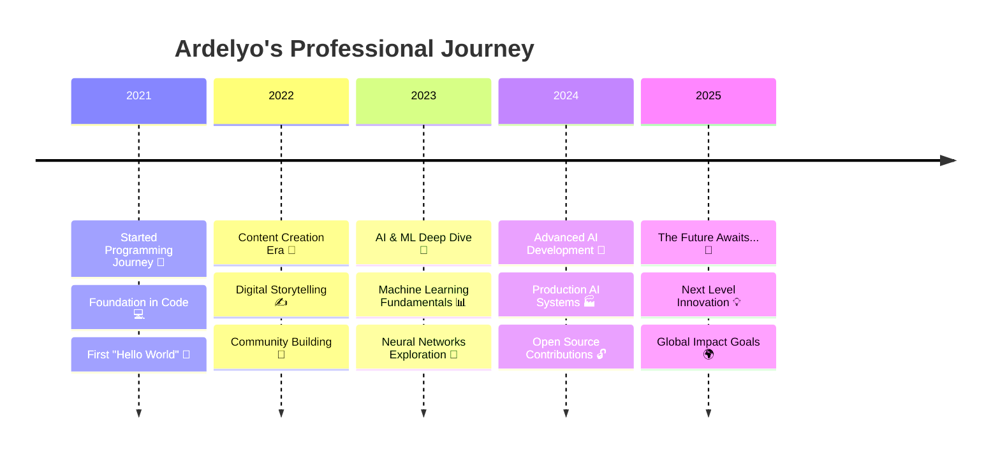

<div align="center">

# 🌟 **ARDELYO (LYO)** 🌟
### *Artificial Intelligence Enthusiast | Machine Learning Developer | Content Creator*

[](https://git.io/typing-svg)

---


</div>

---

## 🎯 **ABOUT ME**


```yaml
name: "Ardelyo (Lyo)"
located_in: "Indonesia 🇮🇩"
current_job: "AI/ML Student & Developer"
education: ["Artificial Intelligence", "Machine Learning"]
company: "Self-Employed & Open Source"

fields_of_interests: 
  - "Artificial Intelligence 🤖"
  - "Machine Learning 📊"
  - "Deep Learning 🧠"
  - "Natural Language Processing 💬"
  - "Computer Vision 👁️"
  - "Content Creation ✍️"

technical_background:
  - "AI/ML Development"
  - "Full-Stack Development"
  - "Technical Writing"
  - "Open Source Contribution"

currently_learning: 
  - "Advanced Deep Learning 🎓"
  - "Cloud Computing ☁️"
  - "DevOps & MLOps 🔧"
  - "Generative AI 🎨"

hobbies: ["Coding 💻", "Writing ✍️", "Learning New Tech 📚", "Community Building 🤝"]
```

<div align="center">

**💫 "Just a regular Gen Z kid with extraordinary dreams and unstoppable passion for AI!" 💫**

</div>

---

## 📬 **CONNECT WITH ME**

<div align="center">

[](mailto:tahubulatlio12@gmail.com)
[](https://bit.ly/ardelyo)
[](https://github.com/Ardelyo)
[](https://bit.ly/ardelyo)


[](https://github.com/Ardelyo)

</div>

---

## 🚀 **JOURNEY TIMELINE**

<div align="center">



</div>

---

## 💪 **SKILLS & TECHNOLOGIES**

<div align="center">

### 🔥 **CORE EXPERTISE**


### 🤖 **AI & MACHINE LEARNING**


### 🛠️ **FRAMEWORKS & LIBRARIES**


### ☁️ **CLOUD & TOOLS**


</div>

---

## 📊 **SKILL PROFICIENCY**

<div align="center">

| 🎯 **Kategori** | 📈 **Level** | 🛠️ **Technologies** |
|:---|:---:|:---|
| **🤖 AI & Machine Learning** |  | Google AI Studio, Gemini, GPT, Claude |
| **✍️ Technical Writing** |  | Documentation, Content Creation, Blogging |
| **💻 Programming** |  | Python, JavaScript, TypeScript, C++ |
| **🌐 Web Development** |  | React, Node.js, HTML/CSS, APIs |
| **🗣️ Languages** |  | 🇮🇩 Indonesian, 🇺🇸 English, 🇯🇵 Japanese |
| **☁️ Cloud & DevOps** |  | GCP, Docker, CI/CD, Deployment |

</div>

---

## 🏆 **ACHIEVEMENTS & BADGES**

<div align="center">


**🎯 GitHub Stats & Achievements:**

[](https://github.com/ardelyo)

</div>

---

## 📊 **GITHUB ANALYTICS**

<div align="center">


**📈 Contribution Stats:**
- 🔥 **340+** Contributions in the last year
- 📦 **15+** Public Repositories  
- ⭐ **50+** Stars Received
- 🤝 **21+** Pull Requests in collaborative projects

</div>

---

## 🚀 **FEATURED PROJECTS**

<div align="center">

### 🌟 **ACTIVE PROJECTS**

</div>

<table align="center">
<tr>
<td width="50%">

### 🧠 **Deep Thought AI**
[](https://github.com/ardelyo)

**🎯 Multi-Agent AI System**
- 🤖 Google Gemini Integration
- 🧠 Critical Thinking Process
- 🔄 Iterative Problem Solving
- 📊 Complex Query Analysis

**Tech:** `Python` `Gemini API` `Machine Learning`

</td>
<td width="50%">

### 🎭 **Lya AI Personality**
[](https://github.com/ardelyo)

**🎪 Custom AI Personality**
- 🧠 Personalized Responses
- 💬 Natural Language Processing
- 🎨 Creative Interactions
- 📈 Adaptive Learning

**Tech:** `Google Gemini` `NLP` `API Integration`

</td>
</tr>
<tr>
<td width="50%">

### 🌍 **OurCreativity Platform**
[](https://github.com/ardelyo)

**🏛️ Community Hub**
- 👥 Team Profiles
- 📰 News & Updates
- 💬 Community Features
- 📱 Responsive Design

**Tech:** `JavaScript` `HTML/CSS` `Community Management`

</td>
<td width="50%">

### 📝 **PaperFlow Writing**
[](https://github.com/ardelyo)

**✍️ Elegant Writing Platform**
- 📖 Rich Text Editor
- 🎨 Beautiful UI/UX
- 📂 Document Management
- 🤝 Collaborative Features

**Tech:** `TypeScript` `React` `Node.js`

</td>
</tr>
</table>

<div align="center">

### 🎪 **OTHER NOTABLE PROJECTS**

[](https://github.com/ardelyo)
[](https://github.com/ardelyo)
[](https://github.com/ardelyo)
[](https://github.com/ardelyo)

</div>

---

## 🎓 **LEARNING & DEVELOPMENT**

<div align="center">

### 📚 **Current Learning Focus**

<table>
<tr>
<td align="center" width="25%">

<br><strong>Advanced AI/ML</strong>
<br><em>Deep Learning</em>
<br><em>Neural Networks</em>
</td>
<td align="center" width="25%">

<br><strong>Cloud Computing</strong>
<br><em>GCP & AWS</em>
<br><em>Serverless</em>
</td>
<td align="center" width="25%">

<br><strong>DevOps & MLOps</strong>
<br><em>CI/CD Pipelines</em>
<br><em>Model Deployment</em>
</td>
<td align="center" width="25%">

<br><strong>Full-Stack Dev</strong>
<br><em>React Ecosystem</em>
<br><em>Modern Web APIs</em>
</td>
</tr>
</table>

### 🏅 **Certifications & Courses**


- 🎯 **Google Cloud AI/ML Certification**
- 📊 **AWS Machine Learning Fundamentals**  
- ⚛️ **Advanced React Development**
- 🐍 **Python for Data Science Specialization**
- 🤖 **Deep Learning with TensorFlow & PyTorch**

</div>

---

## 💡 **PHILOSOPHY & VISION**

<div align="center">

```ascii
╔═══════════════════════════════════════════════════════════════╗
║  "Teknologi terbaik adalah yang tidak hanya memecahkan        ║
║   masalah, tetapi juga menginspirasi orang untuk bermimpi     ║
║   lebih besar dan menciptakan masa depan yang lebih baik."    ║
║                                                               ║
║                        - Ardelyo (Lyo)                       ║
╚═══════════════════════════════════════════════════════════════╝
```

### 🎯 **MY MISSION**

<table align="center">
<tr>
<td align="center" width="33%">

<br><strong>🚀 INNOVATE</strong>
<br><em>Menciptakan solusi AI yang berdampak positif untuk Indonesia dan dunia</em>
</td>
<td align="center" width="33%">

<br><strong>🤝 SHARE</strong>
<br><em>Berbagi pengetahuan dan membangun komunitas developer yang kuat</em>
</td>
<td align="center" width="33%">

<br><strong>📈 GROW</strong>
<br><em>Terus belajar, berkembang, dan menginspirasi generasi mendatang</em>
</td>
</tr>
</table>

**🌟 VISION 2030:** *Menjadi AI Engineer terdepan yang menciptakan teknologi ethical dan accessible untuk semua kalangan*

</div>

---

## 🎪 **FUN FACTS & INTERESTS**

<div align="center">


```python
class ArdeLyo:
    def __init__(self):
        self.age = "Gen Z"
        self.location = "Indonesia 🇮🇩"
        self.personality = ["Curious", "Creative", "Persistent"]
        self.favorite_quote = "Code with Purpose, Create with Passion"
        
    def daily_routine(self):
        activities = [
            "☕ Coffee + Code",
            "🤖 AI Research", 
            "📚 Learning New Tech",
            "✍️ Writing & Blogging",
            "🎮 Gaming (sometimes)",
            "🌙 Dreaming Big"
        ]
        return activities
    
    def fun_facts(self):
        return {
            "🎵": "Loves coding with lo-fi music",
            "🌃": "Night owl developer",
            "🍜": "Instant noodle connoisseur",
            "📱": "Always curious about new apps",
            "🎯": "Believes AI will change everything",
            "🚀": "Dreams of working at tech giants"
        }

# Initialize the awesome developer
lyo = ArdeLyo()
print("Ready to change the world! 🌍✨")
```

</div>

---

## 🤝 **LET'S COLLABORATE!**

<div align="center">

### 🎯 **OPEN FOR OPPORTUNITIES**

<table>
<tr>
<td align="center" width="25%">

<br><strong>💼 JOB OPPORTUNITIES</strong>
<br><em>Internship, Freelance, Full-time</em>
<br><em>AI/ML Developer Roles</em>
</td>
<td align="center" width="25%">

<br><strong>🤝 COLLABORATIONS</strong>
<br><em>Open Source Projects</em>
<br><em>Research & Innovation</em>
</td>
<td align="center" width="25%">

<br><strong>💬 DISCUSSIONS</strong>
<br><em>AI/ML Trends</em>
<br><em>Tech Innovations</em>
</td>
<td align="center" width="25%">

<br><strong>👨‍🏫 MENTORSHIP</strong>
<br><em>Learning from Seniors</em>
<br><em>Helping Juniors</em>
</td>
</tr>
</table>

### 📞 **GET IN TOUCH**

[](mailto:tahubulatlio12@gmail.com)
[](https://bit.ly/ardelyo)
[](https://github.com/Ardelyo)

**⚡ Response Time:** Usually within 24 hours  
**🌍 Timezone:** WIB (UTC+7) - Indonesia  
**💬 Languages:** Indonesian, English, Japanese  

</div>

---

<div align="center">


### 💫 **THANK YOU FOR VISITING!** 💫

**⭐ Star this repository if you found it interesting!**  
**🔔 Follow for more awesome projects and updates!**

---

**🎯 "The future belongs to those who learn, adapt, and create!"**

[](https://github.com/ardelyo)
[](https://github.com/ardelyo)

*Crafted with passion by **ARDELYO** | Keep innovating! 🚀*

</div>
