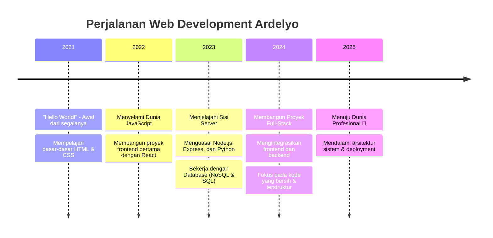

<div align="center">


# **ARDELYO (LYO)**

### Siswa SMA & Full-Stack Web Developer (16 tahun) dari Bandung, Indonesia. Saya membangun aplikasi web yang fungsional dan elegan dengan fokus pada ekosistem JavaScript dan keahlian mendalam di Python.

<a href="https://bit.ly/ardelyo" target="_blank">
  
</a>
<a href="https://github.com/Ardelyo" target="_blank">
  
</a>
<a href="mailto:tahubulatlio12@gmail.com">
  
</a>
<!-- Tambahkan link LinkedIn Anda jika ada, jika tidak, hapus baris ini -->
<a href="#" target="_blank">
  
</a>

</div>

---

## 🚀 **PROYEK UNGGULAN**
<div align="center">

*Berikut adalah beberapa proyek yang saya banggakan. Demo langsung dan studi kasus akan segera hadir di portofolio web saya.*

</div>

<!-- 
  CATATAN PENTING UNTUK ANDA, ARDELYO:
  Kartu proyek di bawah TIDAK AKAN MUNCUL jika Anda tidak mengganti `repo=nama-repo-anda` dengan NAMA REPOSITORY PUBLIK Anda yang sesungguhnya. 
  Contoh: ganti `nama-repo-anda` dengan `portfolio-website` jika Anda punya repo tersebut. Lakukan ini untuk keempat proyek.
-->

<table align="center">
<tr>
<td width="50%">

### 🌐 **Personal Portfolio Website**
[](https://github.com/ardelyo/portfolio-v2)

**🎯 Tujuan:** Menciptakan pusat digital untuk menampilkan proyek dan keahlian saya.  
**⚙️ Solusi:** Dibangun dengan Next.js untuk performa secepat kilat dan desain responsif menggunakan Tailwind CSS.  
**🛠️ Teknologi:** `Next.js`, `React`, `TypeScript`, `Tailwind CSS`, `Vercel`

</td>
<td width="50%">

### 🛒 **E-Commerce Backend API**
[](https://github.com/ardelyo/ecommerce-api)

**🎯 Tujuan:** Merancang sistem API yang andal untuk aplikasi e-commerce.  
**⚙️ Solusi:** API RESTful dengan Node.js dan Express, mencakup autentikasi (JWT), manajemen produk, dan proses transaksi.  
**🛠️ Teknologi:** `Node.js`, `Express`, `MongoDB`, `JWT`, `Postman`

</td>
</tr>
<tr>
<td width="50%">

### 💬 **Real-time Chat App**
[](https://github.com/ardelyo/chatapp-socketio)

**🎯 Tujuan:** Membangun aplikasi obrolan instan dengan fungsionalitas real-time.  
**⚙️ Solusi:** Menggunakan Socket.IO untuk komunikasi dua arah antara klien dan server, dengan antarmuka yang dibuat menggunakan React.  
**🛠️ Teknologi:** `React`, `Node.js`, `Socket.IO`, `CSS Modules`

</td>
<td width="50%">

### 🐍 **Data Scraper with Python**
[](https://github.com/ardelyo/python-scraper)

**🎯 Tujuan:** Mengotomatiskan pengumpulan data dari berbagai situs web.  
**⚙️ Solusi:** Membuat skrip Python yang efisien menggunakan BeautifulSoup dan Requests untuk parsing HTML dan menyimpan data secara terstruktur.  
**🛠️ Teknologi:** `Python`, `BeautifulSoup`, `Requests`, `Pandas`

</td>
</tr>
</table>

---

## 🛠️ **KEAHLIAN & TEKNOLOGI**
<div align="center">

### **Frontend Development**


### **Backend Development**


### **Bahasa & Database**


### **Tools & Lainnya**


</div>

---

## 📊 **ANALITIK GITHUB**
<div align="center">


[GitHub Activity Graph](https://github-readme-activity-graph.vercel.app/graph?username=ardelyo&theme=tokyo-night&hide_border=true&line=FF6B6B&point=FFFFFF&area=true&area_color=0D1117)

</div>

---

## 👨‍💻 **TENTANG SAYA**


```yaml
nama: "Ardelyo (Lyo)"
usia: 16
status: "Siswa SMA Kelas 12"
lokasi: "Bandung, Jawa Barat, Indonesia"
fokus_saat_ini: "Memperdalam arsitektur backend & cloud deployment"
hobi: ["Coding", "Menjelajahi teknologi baru", "Desain UI/UX", "Gaming"]
fakta_menarik: "Saya bisa menghabiskan berjam-jam untuk menyempurnakan satu baris CSS."
```

### **Misi Saya**
> "Membangun aplikasi web yang tidak hanya berfungsi dengan baik, tetapi juga memberikan pengalaman pengguna yang intuitif dan elegan. Saya percaya kode yang bersih adalah fondasi dari produk yang hebat."

---

## 🗺️ **PERJALANAN PENGEMBANGAN SAYA**

<div align="center">


</div>

---

## 🤝 **MARI TERHUBUNG!**
<div align="center">

Saya sangat antusias untuk berkolaborasi dalam proyek open source, magang, atau sekadar berdiskusi tentang tren teknologi terbaru. Jangan ragu untuk menghubungi saya!

<a href="mailto:tahubulatlio12@gmail.com">
  
</a>
<a href="https://bit.ly/ardelyo" target="_blank">
  
</a>

</div>

---

<div align="center">


### **Terima Kasih Telah Berkunjung!**
*Dibuat dengan <3 di Bandung oleh **ARDELYO***

<br>

<p>
  
  
  
</p>

</div>
