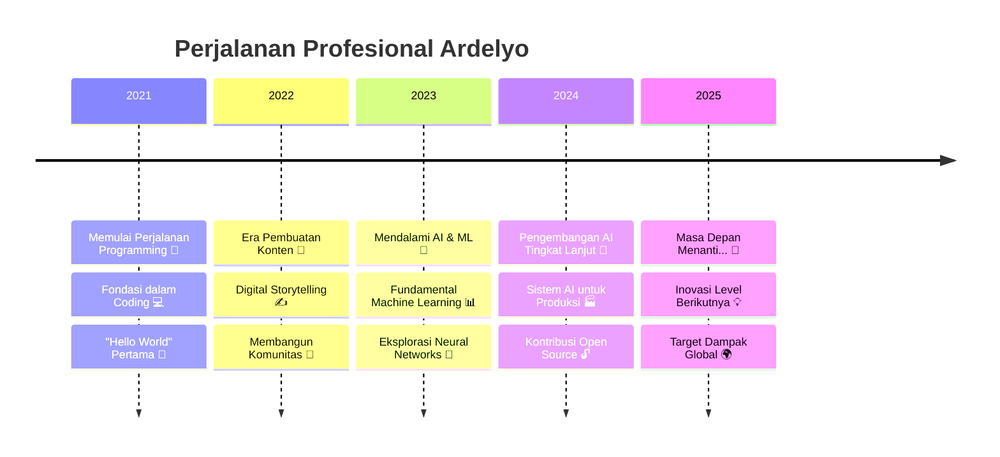

<div align="center">

# 🌟 **ARDELYO (LYO)** 🌟
### *Penggemar Kecerdasan Buatan | Developer Machine Learning | Kreator Konten*

[](https://git.io/typing-svg)

---


</div>

---

## 🎯 **TENTANG SAYA**


```yaml
nama: "Ardelyo (Lyo)"
lokasi: "Indonesia 🇮🇩"
pekerjaan_saat_ini: "Mahasiswa & Developer AI/ML"
pendidikan: ["Artificial Intelligence", "Machine Learning"]
perusahaan: "Freelancer & Kontributor Open Source"

bidang_minat: 
  - "Kecerdasan Buatan 🤖"
  - "Machine Learning 📊"
  - "Deep Learning 🧠"
  - "Natural Language Processing 💬"
  - "Computer Vision 👁️"
  - "Pembuatan Konten ✍️"

latar_belakang_teknis:
  - "Pengembangan AI/ML"
  - "Full-Stack Development"
  - "Technical Writing"
  - "Kontribusi Open Source"

sedang_belajar: 
  - "Deep Learning Tingkat Lanjut 🎓"
  - "Cloud Computing ☁️"
  - "DevOps & MLOps 🔧"
  - "Generative AI 🎨"

hobi: ["Coding 💻", "Menulis ✍️", "Belajar Teknologi Baru 📚", "Membangun Komunitas 🤝"]
```

<div align="center">

**💫 "Hanya anak Gen Z biasa dengan mimpi luar biasa dan passion yang tak terbendung untuk AI!" 💫**

</div>

---

## 📬 **HUBUNGI SAYA**

<div align="center">

[](mailto:tahubulatlio12@gmail.com)
[](https://bit.ly/ardelyo)
[](https://github.com/Ardelyo)
[](https://bit.ly/ardelyo)


[](https://github.com/Ardelyo)

</div>

---

## 🚀 **TIMELINE PERJALANAN**

<div align="center">



</div>

---

## 💪 **KEAHLIAN & TEKNOLOGI**

<div align="center">

### 🔥 **KEAHLIAN INTI**


### 🤖 **AI & MACHINE LEARNING**


### 🛠️ **FRAMEWORK & LIBRARY**


### ☁️ **CLOUD & TOOLS**


</div>

---

## 📊 **TINGKAT KEMAHIRAN**

<div align="center">

| 🎯 **Kategori** | 📈 **Level Kemahiran** | 🛠️ **Teknologi** |
|:---|:---:|:---|
| **🤖 AI & Machine Learning** | `████████░░ (85%)` | Google AI Studio, Gemini, GPT, Claude |
| **✍️ Technical Writing** | `█████████░ (90%)` | Dokumentasi, Pembuatan Konten, Blogging |
| **💻 Programming** | `███████░░░ (75%)` | Python, JavaScript, TypeScript, C++ |
| **🌐 Web Development** | `██████░░░░ (65%)` | React, Node.js, HTML/CSS, APIs |
| **🗣️ Bahasa** | `████████░░ (80%)` | 🇮🇩 Indonesia, 🇺🇸 Inggris, 🇯🇵 Jepang |
| **☁️ Cloud & DevOps** | `█████░░░░░ (50%)` | GCP, Docker, CI/CD, Deployment |

</div>

---

## 🏆 **PRESTASI & LENCANA**

<div align="center">


**🎯 Statistik & Prestasi GitHub:**

[](https://github.com/ardelyo)

</div>

---

## 📊 **ANALITIK GITHUB**

<div align="center">


**📈 Statistik Kontribusi:**
- 🔥 **340+** Kontribusi dalam setahun terakhir
- 📦 **15+** Repository Publik  
- ⭐ **50+** Bintang yang Diterima
- 🤝 **21+** Pull Request dalam proyek kolaboratif

</div>

---

## 🚀 **PROYEK UNGGULAN**

<div align="center">

### 🌟 **PROYEK AKTIF**

<!-- 
  CATATAN PENTING:
  Ganti 'repo=nama-repo-anda' dengan nama repository publik Anda yang sesungguhnya agar kartu ini berfungsi. 
  Jika repository tidak ada atau bersifat private, gambar akan menampilkan error. 
-->

</div>

<table align="center">
<tr>
<td width="50%">

### 🧠 **Deep Thought AI**
[](https://github.com/ardelyo/deep-thought-ai)

**🎯 Sistem AI Multi-Agent**
- 🤖 Integrasi Google Gemini
- 🧠 Proses Pemikiran Kritis
- 🔄 Pemecahan Masalah Iteratif
- 📊 Analisis Query Kompleks

**Tech:** `Python` `Gemini API` `Machine Learning`

</td>
<td width="50%">

### 🎭 **Lya AI Personality**
[](https://github.com/ardelyo/lya-ai)

**🎪 Kepribadian AI Kustom**
- 🧠 Respons Terpersonalisasi
- 💬 Natural Language Processing
- 🎨 Interaksi Kreatif
- 📈 Pembelajaran Adaptif

**Tech:** `Google Gemini` `NLP` `Integrasi API`

</td>
</tr>
<tr>
<td width="50%">

### 🌍 **Platform OurCreativity**
[](https://github.com/ardelyo/ourcreativity)

**🏛️ Hub Komunitas**
- 👥 Profil Tim
- 📰 Berita & Update
- 💬 Fitur Komunitas
- 📱 Desain Responsif

**Tech:** `JavaScript` `HTML/CSS` `Manajemen Komunitas`

</td>
<td width="50%">

### 📝 **PaperFlow Writing**
[](https://github.com/ardelyo/paperflow)

**✍️ Platform Menulis Elegan**
- 📖 Rich Text Editor
- 🎨 UI/UX yang Indah
- 📂 Manajemen Dokumen
- 🤝 Fitur Kolaboratif

**Tech:** `TypeScript` `React` `Node.js`

</td>
</tr>
</table>

<div align="center">

### 🎪 **PROYEK LAINNYA YANG MENARIK**

[](https://github.com/ardelyo)
[](https://github.com/ardelyo)
[](https://github.com/ardelyo)
[](https://github.com/ardelyo)

</div>

---

## 🎓 **PEMBELAJARAN & PENGEMBANGAN**

<div align="center">

### 📚 **Fokus Pembelajaran Saat Ini**

<table>
<tr>
<td align="center" width="25%">

<br><strong>AI/ML Tingkat Lanjut</strong>
<br><em>Deep Learning</em>
<br><em>Neural Networks</em>
</td>
<td align="center" width="25%">

<br><strong>Cloud Computing</strong>
<br><em>GCP & AWS</em>
<br><em>Serverless</em>
</td>
<td align="center" width="25%">

<br><strong>DevOps & MLOps</strong>
<br><em>CI/CD Pipelines</em>
<br><em>Model Deployment</em>
</td>
<td align="center" width="25%">

<br><strong>Full-Stack Dev</strong>
<br><em>Ekosistem React</em>
<br><em>Modern Web APIs</em>
</td>
</tr>
</table>

### 🏅 **Sertifikasi & Kursus**


- 🎯 **Sertifikasi Google Cloud AI/ML**
- 📊 **Fundamental AWS Machine Learning**  
- ⚛️ **Pengembangan React Tingkat Lanjut**
- 🐍 **Spesialisasi Python untuk Data Science**
- 🤖 **Deep Learning dengan TensorFlow & PyTorch**

</div>

---

## 💡 **FILOSOFI & VISI**

<div align="center">

```ascii
╔═══════════════════════════════════════════════════════════════╗
║  "Teknologi terbaik adalah yang tidak hanya memecahkan        ║
║   masalah, tetapi juga menginspirasi orang untuk bermimpi     ║
║   lebih besar dan menciptakan masa depan yang lebih baik."    ║
║                                                               ║
║                        - Ardelyo (Lyo)                       ║
╚═══════════════════════════════════════════════════════════════╝
```

### 🎯 **MISI SAYA**

<table align="center">
<tr>
<td align="center" width="33%">

<br><strong>🚀 BERINOVASI</strong>
<br><em>Menciptakan solusi AI yang berdampak positif untuk Indonesia dan dunia</em>
</td>
<td align="center" width="33%">

<br><strong>🤝 BERBAGI</strong>
<br><em>Membagikan pengetahuan dan membangun komunitas developer yang kuat</em>
</td>
<td align="center" width="33%">

<br><strong>📈 BERKEMBANG</strong>
<br><em>Terus belajar, tumbuh, dan menginspirasi generasi mendatang</em>
</td>
</tr>
</table>

**🌟 VISI 2030:** *Menjadi AI Engineer terdepan yang menciptakan teknologi ethical dan accessible untuk semua kalangan*

</div>

---

## 🎪 **FAKTA MENARIK & MINAT**

<div align="center">


```python
class ArdeLyo:
    def __init__(self):
        self.umur = "Gen Z"
        self.lokasi = "Indonesia 🇮🇩"
        self.kepribadian = ["Penasaran", "Kreatif", "Tekun"]
        self.quote_favorit = "Koding dengan Tujuan, Berkarya dengan Passion"
        
    def rutinitas_harian(self):
        aktivitas = [
            "☕ Kopi + Koding",
            "🤖 Riset AI", 
            "📚 Belajar Teknologi Baru",
            "✍️ Menulis & Blogging",
            "🎮 Gaming (kadang-kadang)",
            "🌙 Bermimpi Besar"
        ]
        return aktivitas
    
    def fakta_menarik(self):
        return {
            "🎵": "Suka coding dengan musik lo-fi",
            "🌃": "Developer nocturnal",
            "🍜": "Ahli mie instan",
            "📱": "Selalu penasaran dengan aplikasi baru",
            "🎯": "Yakin AI akan mengubah segalanya",
            "🚀": "Bermimpi bekerja di perusahaan teknologi besar"
        }

# Inisialisasi developer yang luar biasa
lyo = ArdeLyo()
print("Siap mengubah dunia! 🌍✨")
```

</div>

---

## 🤝 **MARI BERKOLABORASI!**

<div align="center">

### 🎯 **TERBUKA UNTUK PELUANG**

<table>
<tr>
<td align="center" width="25%">

<br><strong>💼 PELUANG KERJA</strong>
<br><em>Magang, Freelance, Full-time</em>
<br><em>Posisi Developer AI/ML</em>
</td>
<td align="center" width="25%">

<br><strong>🤝 KOLABORASI</strong>
<br><em>Proyek Open Source</em>
<br><em>Riset & Inovasi</em>
</td>
<td align="center" width="25%">

<br><strong>💬 DISKUSI</strong>
<br><em>Tren AI/ML</em>
<br><em>Inovasi Teknologi</em>
</td>
<td align="center" width="25%">

<br><strong>👨‍🏫 MENTORSHIP</strong>
<br><em>Belajar dari Senior</em>
<br><em>Membantu Junior</em>
</td>
</tr>
</table>

### 📞 **HUBUNGI SAYA**

[](mailto:tahubulatlio12@gmail.com)
[](https://bit.ly/ardelyo)
[](https://github.com/Ardelyo)

**⚡ Waktu Respons:** Biasanya dalam 24 jam  
**🌍 Zona Waktu:** WIB (UTC+7) - Indonesia  
**💬 Bahasa:** Indonesia, Inggris, Jepang  

</div>

---

<div align="center">


### 💫 **TERIMA KASIH SUDAH BERKUNJUNG!** 💫

**⭐ Beri bintang pada repository ini jika Anda merasa menarik!**  
**🔔 Follow untuk proyek keren dan update terbaru!**

---

**🎯 "Masa depan milik mereka yang belajar, beradaptasi, dan berkreasi!"**

[](https://github.com/ardelyo)
[](https://github.com/ardelyo/ardelyo)

*Dibuat dengan passion oleh **ARDELYO** | Terus berinovasi! 🚀*

</div>
