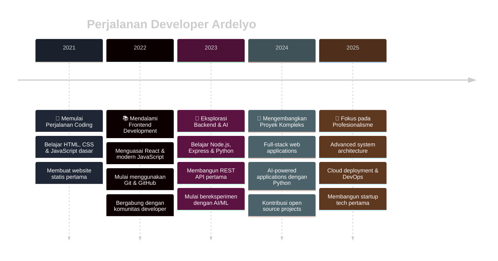

<div align="center">


</div>

---

<div align="center">

### 📊 **STATISTIK PROFIL**


</div>

---

## 🎯 **TENTANG SAYA**


```yaml
nama: "Ardelyo"
alias: "Lyo"
usia: 16
status: "Siswa SMA & Full-Stack Developer"
lokasi: "Bandung, Jawa Barat 🇮🇩"
passion: "Membangun solusi digital yang elegan & fungsional"
specialization: 
  - "🌐 Pengembangan Web Full-Stack"
  - "🤖 Artificial Intelligence"
  - "🐍 Python Development"
  - "⚡ Modern JavaScript Ecosystem"
currently_learning: "Advanced AI/ML & Cloud Architecture"
fun_fact: "Saya bisa menghabiskan berjam-jam untuk menyempurnakan satu pixel! 🎨"
```

### 💭 **FILOSOFI PENGEMBANGAN**
> *"Kode yang bersih adalah cerminan dari pemikiran yang jernih. Setiap baris kode yang saya tulis adalah langkah menuju masa depan digital yang lebih baik."*

---

## 🛠️ **STACK TEKNOLOGI**

<div align="center">

### **Frontend Development**


### **Backend Development**


### **Database & Cloud**


### **Tools & DevOps**


### **AI & Machine Learning**


</div>

---

## 🚀 **PROYEK UNGGULAN**

<div align="center">

### 💼 **PORTOFOLIO PROFESIONAL**

</div>

<!-- Proyek Web Development -->
<details>
<summary><b>🌐 Web Development Projects</b></summary>
<br>

<table>
<tr>
<td width="50%">

### 🎨 **Personal Portfolio V2**
[](https://github.com/ardelyo/portfolio-v2)

**🎯 Deskripsi:**  
Website portfolio pribadi dengan desain modern dan performa optimal

**⚡ Teknologi:**
- Next.js 14 dengan App Router
- TypeScript untuk type safety
- Tailwind CSS untuk styling
- Framer Motion untuk animasi

**🌟 Fitur Utama:**
- ⚡ Loading time < 2 detik
- 📱 Fully responsive design
- 🎨 Dark/Light theme toggle
- 📊 Real-time GitHub stats integration

</td>
<td width="50%">

### 🛒 **E-Commerce API**
[](https://github.com/ardelyo/ecommerce-api)

**🎯 Deskripsi:**  
RESTful API lengkap untuk aplikasi e-commerce dengan fitur enterprise-grade

**⚡ Teknologi:**
- Node.js & Express.js
- MongoDB dengan Mongoose
- JWT Authentication
- Redis untuk caching

**🌟 Fitur Utama:**
- 🔐 Authentication & Authorization
- 💳 Payment gateway integration
- 📦 Inventory management
- 📊 Analytics dashboard

</td>
</tr>
</table>

</details>

<!-- Proyek AI & Python -->
<details>
<summary><b>🤖 AI & Python Projects</b></summary>
<br>

<table>
<tr>
<td width="50%">

### 🧠 **Deep Thought AI**
[](https://github.com/ardelyo/deep-thought-ai)

**🎯 Deskripsi:**  
Sistem AI multi-agent canggih untuk pemecahan masalah kompleks

**⚡ Teknologi:**
- Python 3.11+
- Google Gemini API
- FastAPI untuk web interface
- SQLite untuk data persistence

**🌟 Fitur Utama:**
- 🧠 Multi-agent reasoning system
- 🔄 Iterative problem solving
- 📊 Real-time analysis dashboard
- 🎯 Context-aware responses

</td>
<td width="50%">

### 🗂️ **CodeX AI File Assistant**
[](https://github.com/ardelyo/CodeX-AI-File-Assistant)

**🎯 Deskripsi:**  
AI-powered file management assistant dengan natural language processing

**⚡ Teknologi:**
- Python dengan Tkinter GUI
- OpenAI GPT API
- File system integration
- Natural Language Processing

**🌟 Fitur Utama:**
- 📁 Smart file organization
- 🔍 AI-powered search
- 🏷️ Automatic tagging
- 💬 Natural language commands

</td>
</tr>
</table>

</details>

---

## 📈 **AKTIVITAS GITHUB**

<div align="center">

[](https://github.com/ardelyo)

</div>

### 🏆 **PENCAPAIAN GITHUB**

<div align="center">

[](https://github.com/ryo-ma/github-profile-trophy)

</div>

---

## 🛤️ **PERJALANAN DEVELOPER**

<div align="center">



</div>

---

## 💡 **KEAHLIAN & SPESIALISASI**

<div align="center">

<table>
<tr>
<td align="center" width="25%">

<br><strong>Frontend</strong>
<br><sub>React, Next.js, TypeScript</sub>
</td>
<td align="center" width="25%">

<br><strong>Backend</strong>
<br><sub>Node.js, Express, Python</sub>
</td>
<td align="center" width="25%">

<br><strong>AI/ML</strong>
<br><sub>Python, TensorFlow, APIs</sub>
</td>
<td align="center" width="25%">

<br><strong>Database</strong>
<br><sub>MongoDB, PostgreSQL</sub>
</td>
</tr>
</table>

### 📊 **LEVEL KEAHLIAN**

<div align="left">

**Frontend Development** `████████████████████` 95%  
**Backend Development** `█████████████████` 85%  
**Python Programming** `██████████████████` 90%  
**AI/Machine Learning** `██████████████` 70%  
**Database Management** `█████████████████` 85%  
**DevOps & Deployment** `████████████` 60%  

</div>

</div>

---

## 🌐 **KONEKSI & KOLABORASI**

<div align="center">

### 📫 **HUBUNGI SAYA**

<a href="mailto:tahubulatlio12@gmail.com">
  
</a>
<a href="https://bit.ly/ardelyo" target="_blank">
  
</a>
<a href="https://github.com/ardelyo" target="_blank">
  
</a>
<a href="#" target="_blank">
  
</a>

### 🤝 **TERBUKA UNTUK**

- 🚀 **Kolaborasi Proyek Open Source**
- 💼 **Peluang Magang & Freelance**
- 🎯 **Diskusi Teknologi & Inovasi**
- 🌱 **Mentoring & Knowledge Sharing**

</div>

---

## 📊 **STATISTIK REPOSITORY**

<div align="center">


<br>


</div>

---

## 💭 **QUOTE FAVORIT**

<div align="center">

> *"Code is like humor. When you have to explain it, it's bad."*  
> — **Cory House**

<br>

> *"The best way to predict the future is to create it."*  
> — **Peter Drucker**

</div>

---

<div align="center">

### 🎨 **DESAIN DENGAN ❤️**


**Terima kasih telah mengunjungi profil saya!**  
*Dibuat dengan kode, kopi, dan dedikasi dari Bandung* ☕

<br>


<br><br>

**💻 Happy Coding! 🚀**

</div>
