<div align="center">


# **ARDELYO (LYO)**

### AI/ML Developer dari Indonesia yang berspesialisasi dalam Natural Language Processing & Sistem Agen Cerdas. Saya membangun solusi AI menggunakan Python, TensorFlow, dan ekosistem Google AI.

<a href="https://bit.ly/ardelyo" target="_blank">
  
</a>
<a href="https://github.com/Ardelyo" target="_blank">
  
</a>
<a href="mailto:tahubulatlio12@gmail.com">
  
</a>
<a href="https://www.linkedin.com/in/ardelyo" target="_blank">
  
</a>

</div>

---

## 🚀 **PROYEK UNGGULAN**
<div align="center">

*Studi kasus mendalam dan demo langsung tersedia di portofolio web saya.*

</div>

<table align="center">
<tr>
<td width="50%">

### 🧠 **Deep Thought AI**
[](https://github.com/ardelyo/deep-thought-ai)

**🎯 Tujuan:** Memecah kueri kompleks menjadi langkah-langkah yang dapat ditindaklanjuti oleh sistem AI.  
**🤖 Solusi:** Mengembangkan agen AI otonom menggunakan Google Gemini API untuk penalaran kritis dan pemecahan masalah secara iteratif.  
**🛠️ Teknologi:** `Python`, `Gemini API`, `LangChain`, `Machine Learning`

**[Live Demo 🚀](link-to-your-demo) | [Studi Kasus 📖](link-to-your-portfolio-page)**

</td>
<td width="50%">

### 🎭 **Lya AI Personality**
[](https://github.com/ardelyo/lya-ai)

**🎯 Tujuan:** Menciptakan kepribadian AI yang dapat disesuaikan untuk interaksi yang lebih alami dan personal.  
**🤖 Solusi:** Menggunakan teknik Natural Language Processing dan fine-tuning pada model Gemini untuk menghasilkan respons yang unik dan adaptif.  
**🛠️ Teknologi:** `Google Gemini`, `NLP`, `API Integration`, `Python`

**[Live Demo 🚀](link-to-your-demo) | [Studi Kasus 📖](link-to-your-portfolio-page)**

</td>
</tr>
<tr>
<td width="50%">

### 🌍 **Platform OurCreativity**
[](https://github.com/ardelyo/ourcreativity)

**🎯 Tujuan:** Menyediakan hub digital terpusat untuk sebuah komunitas kreatif.  
**🤖 Solusi:** Membangun platform web responsif yang menampilkan profil tim, berita, dan fitur interaksi komunitas.  
**🛠️ Teknologi:** `JavaScript`, `HTML/CSS`, `Community Management`

**[Live Demo 🚀](link-to-your-demo) | [Studi Kasus 📖](link-to-your-portfolio-page)**

</td>
<td width="50%">

### 📝 **PaperFlow Writing**
[](https://github.com/ardelyo/paperflow)

**🎯 Tujuan:** Menciptakan lingkungan menulis yang minimalis dan bebas gangguan dengan fungsionalitas modern.  
**🤖 Solusi:** Merancang dan mengembangkan platform menulis dengan editor kaya teks, UI/UX yang bersih, dan manajemen dokumen.  
**🛠️ Teknologi:** `TypeScript`, `React`, `Node.js`, `UI/UX Design`

**[Live Demo 🚀](link-to-your-demo) | [Studi Kasus 📖](link-to-your-portfolio-page)**

</td>
</tr>
</table>

---

## 🛠️ **KEAHLIAN & TEKNOLOGI**
<div align="center">

### **Bahasa & Keahlian Inti**


### **AI & Machine Learning**


### **Framework, Library & Tools**


</div>

---

## 📊 **ANALITIK GITHUB**
<div align="center">


</div>

---

## 💡 **TENTANG SAYA & FILOSOFI TEKNIS**


```yaml
nama: "Ardelyo (Lyo)"
lokasi: "Indonesia 🇮🇩"
fokus_teknis: ["Artificial Intelligence", "Machine Learning"]
peran: "Developer & Kontributor Open Source"
tujuan_karir: "Berkontribusi pada proyek Generative AI dan MLOps, dengan tujuan jangka panjang memimpin tim yang mengembangkan teknologi AI yang etis dan dapat diakses untuk audiens global."
```

### **Filosofi Teknis Saya**
> "Saya percaya pada pengembangan AI yang etis, efisien, dan dapat diakses. Fokus saya adalah menerjemahkan model teoretis yang kompleks menjadi aplikasi praktis yang memberikan nilai nyata."

---

## 🗺️ **PERJALANAN & PENGEMBANGAN**

### **Timeline Profesional**

```mermaid
timeline
    title Perjalanan Profesional Ardelyo
    2021 : Memulai Perjalanan Programming 🚀
    2022 : Era Pembuatan Konten & Komunitas 📝
    2023 : Mendalami AI & Machine Learning 🤖
    2024 : Pengembangan & Kontribusi Sistem AI 🌟
    2025 : Fokus pada Aplikasi Produksi & MLOps 🏭
```

<div align="center">


</div>

### **Fokus Pembelajaran Saat Ini**
<div align="center">

| **AI/ML Tingkat Lanjut** | **Cloud & MLOps** | **Full-Stack Development** |
|:---:|:---:|:---:|
| Deep Learning | GCP & AWS | Ekosistem React |
| Generative AI | CI/CD & Deployment | Modern Web APIs |
| Neural Networks | Docker & Serverless | Sistem Terdistribusi |

</div>

---

## 🤝 **MARI BERKOLABORASI**
<div align="center">

Saya selalu terbuka untuk berdiskusi tentang teknologi, ide proyek, atau peluang menarik.

### **Terbuka untuk Peluang:**
<p>
  
  
  
</p>

### **Hubungi Saya:**
<a href="mailto:tahubulatlio12@gmail.com">
  
</a>
<a href="https://bit.ly/ardelyo" target="_blank">
  
</a>

**Zona Waktu:** WIB (UTC+7) - Indonesia | **Bahasa:** Indonesia, Inggris, Jepang

</div>

---

<div align="center">


### **Terima Kasih Telah Berkunjung!**
*Dibuat oleh **ARDELYO** | Terus berinovasi! 🚀*

<br>

<p>
  
  
  
</p>

</div>
